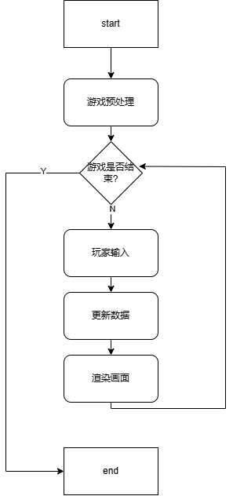

# GameBase
Using C++ language, build a general-purpose game framework that provides fundamental functionalities such as game objects, resource management, and scene states to external systems.

## 开始
- 本游戏框架依照如下流程图设置:

- 游戏框架中存在一个基本的游戏对象GameObject, 存在三个主要的方法: onInput, onUpdate, onRender. 在框架中, onInput的处理交给输入管理器, 不需要每个游戏对象调用输入函数(需要的时候从输入管理器那里获取即可), 由于游戏中的图像加载后,渲染是由游戏框架进行的, 那么update分为两个重载函数, 一个传入delta, 一个不传入delta. 其中update(int delta) 是游戏框架使用的, 没有参数的那个是提供给用户继承所使用的
- 如何使用?
  - 在知道游戏的基本单位是gameObject后, 游戏的基本运行单位是Scene场景.游戏对象分别加载入不同的scene场景，由scene统一的管理它们的输入、更新、渲染  
  - Scene存在一个管理类, 用来加载各种场景, 在主循环中便于处理当前场景的输入、更新、渲染  
- 框架对象
  - 资源管理器
  - 输入管理器
  - <a href="./doc/Scene.md">场景管理器</a>
  - 摄像机对象
  - 游戏对象
  - <a href="./doc/component/component.md">组件</a> 
    1. 图像 / 动画控制器  
    2. 碰撞箱
    3. 刚体
    4. 文本
    5. 音频

## 游戏示例
- 位置: ``./gamedemo/``
- Example.cpp : 游戏api示例使用
- src/: 2D横板rpg简单demo 